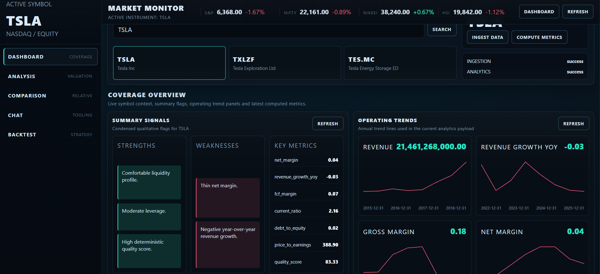
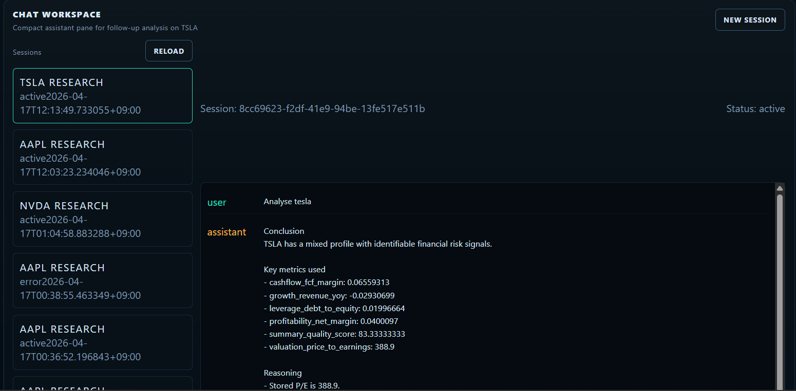
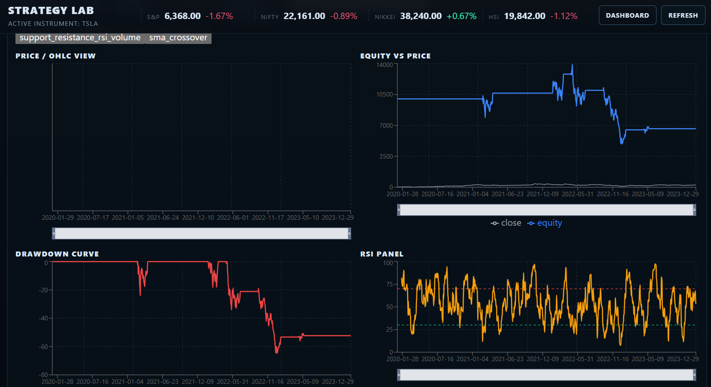
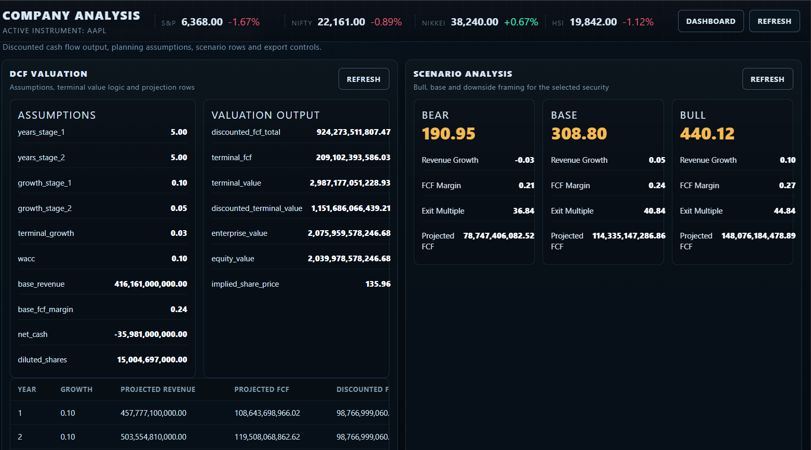
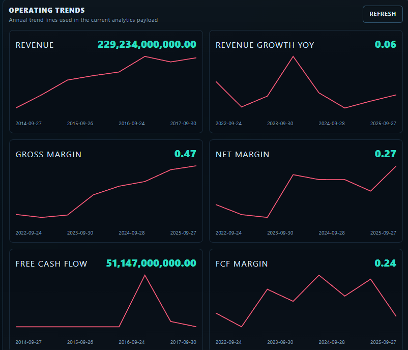
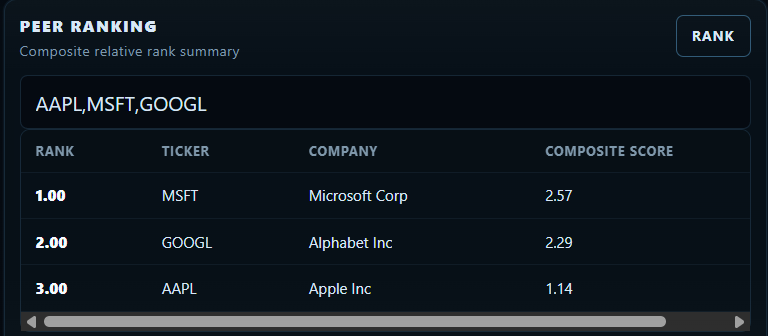
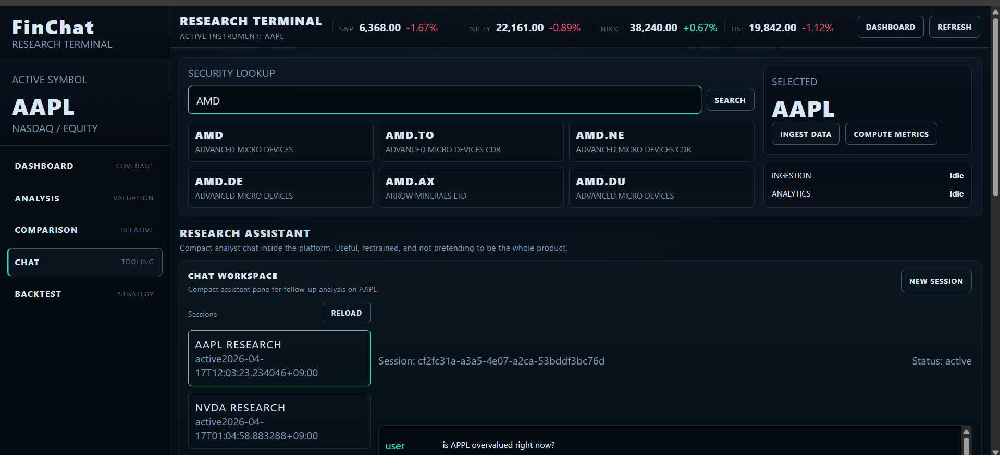

# FinChat 📊

AI-powered financial analysis and backtesting platform.

A full-stack system combining financial analytics, valuation, backtesting, and an agentic AI assistant.

---

## 🚀 Key Highlights

- Built **9 Django apps** with **25 API endpoints**
- Designed **17 data models** and **26 service-layer abstractions**
- Developed **React frontend with 34 components**
- Implemented **40+ financial metrics**
- Integrated **5 trading strategies** with **14 KPIs**
- Built **agentic AI system (LangChain + LangGraph)** with:
  - 11 tools
  - 6 execution nodes
  - 8 query intents

---

## ⚡ Performance Metrics

| Component | Latency |
|----------|--------|
| API Root | 11.4 ms |
| Company Data API | ~47 ms |
| Metrics API | ~46 ms |
| Analysis Summary | ~15 ms |
| Chat Query | ~1.4 s |
| Ticker Search | ~494 ms |

---

## 🖥️ UI Preview

### Dashboard


### Chat Panel


### Backtesting Panel


### Valuation Panel


### Trend Charts


### Peer Ranking


### Ticker Lookup


---

## 🏗️ Tech Stack

### Backend
- Django + DRF
- PostgreSQL
- Celery + Redis
- LangChain + LangGraph

### Frontend
- React
- Tailwind CSS
- Chart libraries

---

## ⚙️ Setup

### Clone
```bash
git clone https://github.com/your-username/finchat.git
cd finchat
```

### Docker
```bash
docker-compose up --build
```

### Backend
```bash
cd backend
pip install -r requirements.txt
python manage.py migrate
python manage.py runserver
```

### Frontend
```bash
cd frontend
npm install
npm run dev
```

---

## 🔄 System Workflow

1. Data ingestion
2. Storage (PostgreSQL)
3. Metric computation
4. Valuation engine
5. Backtesting engine
6. AI query orchestration
7. Dashboard visualization

---

## 🧠 Example Query

"Analyze Apple stock for 2022 using RSI backtesting"

---

## 📊 Financial Capabilities

- Profitability, growth, leverage, liquidity metrics
- Trend analysis
- Peer comparison
- Risk flags
- DCF-based valuation
- Multi-strategy backtesting

---

## 📁 Structure

```
finchat/
├── backend/
|      ├── docker-compose.yml
├── frontend/
├── README.md
```

---

## 📌 Author

Rachit Mahajan  
IIT Kanpur
